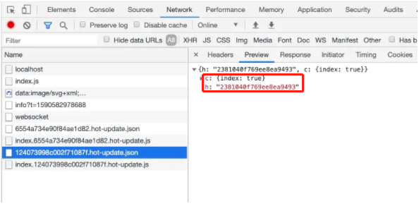

## webapck 热更新原理

- Webpack Compile：将 JS 源代码编译成 bundle.js
- HMR Server：用来将热更新的文件输出给 HMR Runtime
- Bundle Server：静态资源文件服务器，提供文件访问路径
- HMR Runtime：socket服务器，会被注入到浏览器，更新文件的变化
- bundle.js：构建输出的文件
- 在HMR Runtime 和 HMR Server之间建立 websocket，即图上4号线，用于实时更新文件变化

**两个阶段**

1. 启动阶段

> 1 - 2 - A - B
> 
> 在编写未经过webpack打包的源代码后，Webpack Compile 将源代码和 HMR Runtime 一起编译成 bundle 文件，传输给 Bundle Server 静态资源服务器

2. 更新阶段
> 1 - 2 - 3 - 4
> 当某一个文件或者模块发生变化时，webpack 监听到文件变化对文件重新编译打包，编译生成唯一hash值，这个hash 值用来作为下一次热更新的标识
> 
>根据变化的内容生成两个补丁文件：manifest（包含了 hash 和 chundId ，用来说明变化的内容和 chunk.js 模块
>
>由于socket服务器在HMR Runtime 和 HMR Server之间建立 websocket链接，当文件发生改动的时候，服务端会向浏览器推送一条消息，消息包含文件改动后生成的hash值，如下图的h属性，作为下一次热更细的标识

在浏览器接受到这条消息之前，浏览器已经在上一次 socket 消息中已经记住了此时的 hash 标识，这时候我们会创建一个 ajax 去服务端请求获取到变化内容的 manifest 文件

mainfest文件包含重新build生成的hash值，以及变化的模块，对应上图的c属性

浏览器根据 manifest 文件获取模块变化的内容，从而触发render流程，实现局部模块更新

**总结**
关于webpack热模块更新的总结如下：

- 通过webpack-dev-server创建两个服务器：提供静态资源的服务（express）和Socket服务

- express server 负责直接提供静态资源的服务（打包后的资源直接被浏览器请求和解析）
- socket server 是一个 websocket 的长连接，双方可以通信
- 当 socket server 监听到对应的模块发生变化时，会生成两个文件.json（manifest文件）和.js文件（update chunk）
- 通过长连接，socket server 可以直接将这两个文件主动发送给客户端（浏览器）
- 浏览器拿到两个新的文件后，通过HMR runtime机制，加载这两个文件，并且针对修改的模块进行更新
